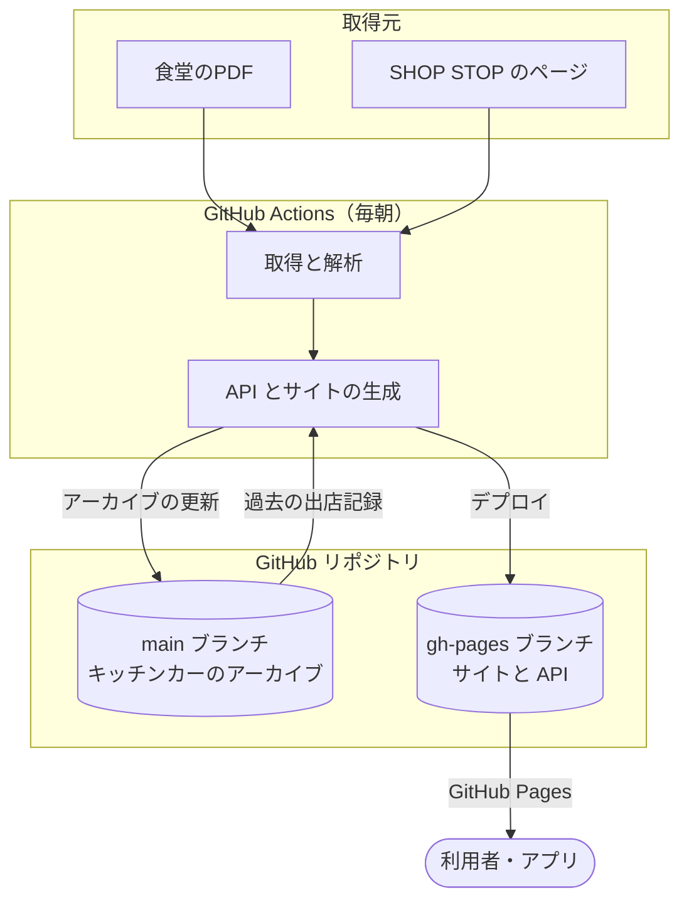

# 概要とシステム構成

## 目的

京都産業大学の食堂・コンビニ・ショップ・ATM、および日替わりで出店するキッチンカーの営業情報を自動で集め、1つのサイトと静的な JSON API で公開します。情報がPDFや外部サイトに散らばっているため、一か所で確認できるようにすることが目的です。

- サイト：<https://tamadalab.github.io/welfare-time/>
- リポジトリ：<https://github.com/tamadalab/welfare-time>

## データソース

| 対象 | 取得元 | 取得方法 |
| :--- | :--- | :--- |
| 食堂・コンビニ・ショップなど | [大学サイトの福利厚生のページ](https://www.kyoto-su.ac.jp/campus/welfare/)からリンクされたPDF | HTTP ヘッダで更新を確認し、更新されていればダウンロードして解析します。 |
| キッチンカー | [SHOP STOP の京都産業大学のページ](https://schedule.mellow.jp/ss_web/markets/KqTl8N) | Playwright でJSの描画を待ってからHTMLを取得し、解析します。単日出店と定期出店の2つの欄があります。 |
| ATM | マスター（`scripts/facilities.json`）の `static-hours` | 営業時間が決まっている施設は、平日と土曜の営業時間から毎日の予定を作ります。 |
| 臨時店舗 | `data/extra/*.json` | 公認ではない店舗や臨時に営業する店舗を、リポジトリに置いた JSON から載せます。 |

## システム構成

サーバーは持たず、GitHub Actions でデータを集めて変換し、GitHub Pages で静的ファイルとして配信します。

- サイトは Hugo で生成します。画面の表示は、ブラウザが API を読み込んで組み立てます。
- API もサイトも gh-pages ブランチに置いた静的ファイルです。

## 更新のタイミング

- GitHub Actions が毎日 JST 7時（UTC 22時）にデータを更新します。実行の混雑により、実際の更新時刻は日によって前後します。9時ごろまでには更新が終わります。
- GitHub Pages のキャッシュにより、更新から API に反映されるまで数分かかることがあります。
- 夏期休暇中（7月中旬〜9月末）はキッチンカーの出店がないため、キッチンカーが0件でも正常です。

## 免責事項

- 大学の公式サイトと SHOP STOP の公開情報を機械的に集めて提供しています。
- 当日の臨時休業やメニューの変更など、取得元の急な変更はすぐには反映されません。
- 情報の正確性は保証せず、サイトや API の利用によって生じた損害の責任は負いません。正確な情報は公式の情報で確認するよう、サイトのヘルプで案内しています。
